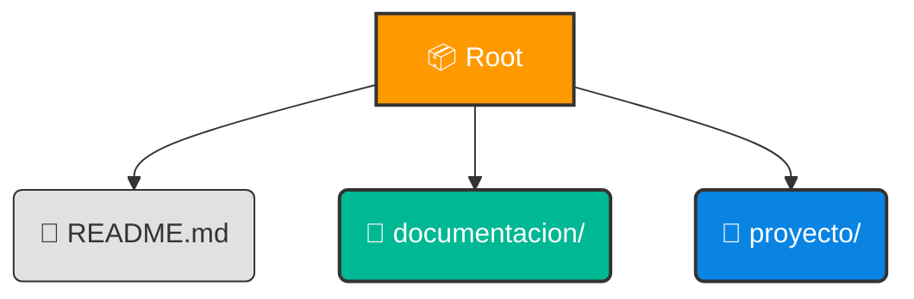

<div align="center">

# 🚀 WONDERTECH SAS

### Repositorio Institucional & Estándares de Ingeniería

[](https://github.com/wondertech-sas)
[](PROT_001)
[](https://odoo.com)

<p align="center">
  <b>Bienvenido al ecosistema de desarrollo de Wondertech SAS.</b><br>
  Este repositorio es la regla principal para nuestros estándares de calidad, políticas de implementación y excelencia operativa.
</p>

</div>

---

## 🌟 Vision General

Este espacio no es solo un repositorio; es el **marco de gobierno** técnico para todos nuestros proyectos. Aquí definimos cómo construimos, probamos y entregamos software que impulsa nuestro negocio.

### 💎 Principios Fundamentales

| Principio                  | Descripción                                                              |
| :------------------------- | :----------------------------------------------------------------------- |
| **🛡️ Auditoría Total**     | Cada línea de código debe ser rastreable a un requerimiento de negocio.  |
| **🎯 ID de Odoo**          | El nexo sagrado entre la gestión y la ingeniería. Sin ID, no hay código. |
| **✅ Calidad vs Cantidad** | El código sin QA y documentación no existe.                              |

---

## 📜 Políticas de Implementación (OBLIGATORIO)

Para garantizar la integridad de nuestros sistemas, aplicamos las siguientes reglas inquebrantables a partir de la fecha de vigencia.

### 1. 🏷️ Estandarización de Nombres

Todo repositorio debe nacer con una identidad clara. El formato **estricto** es:

```bash
[ID_ODOO]_NOMBRE_DEL_PROYECTO_CON_GUION_BAJO
# Ejemplo: 1024_INTEGRACION_SERVIENTREGA
```

### 2. 📦 Reglas de Entrega (Definition of Done)

Una entrega **NO** será aceptada en producción a menos que cumpla con el **Estándar de Oro**:

- [ ] **Release Tag**: Versionado semántico estricto (`vX.Y.Z`).
- [ ] **Evidencia de QA**: Archivo obligatorio en `documentacion/QA.md`.
- [ ] **Notas de Entrega**: Descripción clara de cambios y valor aportado.

> ⚠️ **Advertencia**: _Si falta cualquiera de estos elementos, la entrega se considera **NULA**._

### 3. 📂 Estructura Sagrada del Repositorio

La organización es la base de la mantenibilidad. Tu repositorio **DEBE** respetar esta jerarquía:



O en formato árbol simple:

```bash
/
├── 📄 README.md          # Tu punto de entrada y documentación
├── 📂 documentacion/     # Evidencia de QA y manuales
└── 📂 proyecto/          # Tu código fuente va aquí
```

---

## 🛠️ Flujos de Trabajo (Workflows)

Nuestra metodología se adapta a la complejidad del proyecto, asegurando siempre la calidad.

<details>
<summary><b>🔵 Flujo A: Desarrollo Ágil (Sin PR)</b></summary>
<br>

Ideal para proyectos individuales o fases iniciales.

1. **Dev** crea repo personal: `[ID]_PROYECTO`.
2. **QA/PM** validan funcionalidad.
3. **Dev** genera Release `v1.0.0` + Evidencia QA.
4. **Dev** transfiere la propiedad a la organización **Wondertech**.

</details>

<details>
<summary><b>🟣 Flujo B: Control Estricto (Con PR)</b></summary>
<br>

Para proyectos críticos y colaborativos.

1. **Fork** del repositorio oficial.
2. Desarrollo en ramas (`feature/`, `fix/`).
3. **Pull Request** hacia el repo oficial.
4. Revisión de código obligatoria.
5. Merge realizado **únicamente** por el Integrador asignado.

</details>

---

## 🚀 Stack & Herramientas

<div align="center">

|  Categoría  | Tecnologías                                                                                                                                                                                                         |
| :---------: | :------------------------------------------------------------------------------------------------------------------------------------------------------------------------------------------------------------------ |
|  **Core**   |   |
| **Gestión** |                     |
| **DevOps**  |       |

</div>

---

<div align="center">
  <small>WONDERTECH SAS © 2026 — Construyendo el futuro con excelencia.</small>
</div>
