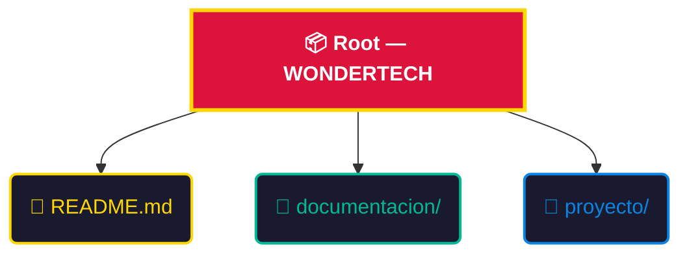
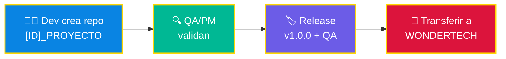
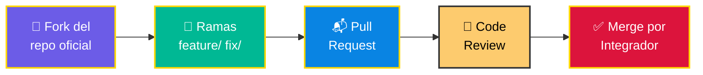

<div align="center">

<!-- ═══════════════════════════════════════════════════════════════ -->
<!-- 🎨 ANIMATED HEADER WITH CAPSULE RENDER (URL LIMPIA)           -->
<!-- ═══════════════════════════════════════════════════════════════ -->


<!-- ═══════════════════════════════════════════════════════════════ -->
<!-- ✨ ANIMATED TYPING SVG                                         -->
<!-- ═══════════════════════════════════════════════════════════════ -->

<a href="https://git.io/typing-svg">
  
</a>

<br/>

<!-- ═══════════════════════════════════════════════════════════════ -->
<!-- 🏷️ ANIMATED BADGES                                            -->
<!-- ═══════════════════════════════════════════════════════════════ -->

[](https://github.com/wondertech-sas)
[](PROT_001)
[](https://odoo.com)
[](documentacion/)

<br/>


</div>

<!-- ═══════════════════════════════════════════════════════════════ -->
<!-- 🌟 VISIÓN GENERAL                                              -->
<!-- ═══════════════════════════════════════════════════════════════ -->

##  &nbsp;Visión General — WONDERTECH SAS

> [!IMPORTANT]
> Este espacio no es solo un repositorio; es el **marco de gobierno** técnico de **WONDERTECH SAS** para todos nuestros proyectos. Aquí definimos cómo construimos, probamos y entregamos software que impulsa nuestro negocio.

<br/>

<div align="center">

### 💎 Principios Fundamentales de WONDERTECH

<table>
<tr>
<td align="center" width="33%">

### 🛡️
### Auditoría Total
Cada línea de código debe ser rastreable a un **requerimiento de negocio** en **WONDERTECH SAS**.

</td>
<td align="center" width="33%">

### 🎯
### ID de Odoo
El nexo sagrado entre la gestión y la ingeniería. **Sin ID, no hay código.**

</td>
<td align="center" width="33%">

### ✅
### Calidad vs Cantidad
El código sin **QA y documentación** no existe en **WONDERTECH**.

</td>
</tr>
</table>

</div>


<!-- ═══════════════════════════════════════════════════════════════ -->
<!-- 📜 POLÍTICAS DE IMPLEMENTACIÓN                                 -->
<!-- ═══════════════════════════════════════════════════════════════ -->

##  &nbsp;Políticas de Implementación — WONDERTECH SAS

> [!CAUTION]
> Las siguientes reglas son **INQUEBRANTABLES** dentro de **WONDERTECH SAS** y aplican a partir de la fecha de vigencia. Su incumplimiento invalida cualquier entrega.

<br/>

### 1️⃣ &nbsp;🏷️ Estandarización de Nombres

Todo repositorio de **WONDERTECH** debe nacer con una identidad clara. El formato **estricto** es:

```bash
# ╔══════════════════════════════════════════════════╗
# ║  FORMATO WONDERTECH: [ID_ODOO]_NOMBRE_PROYECTO  ║
# ╚══════════════════════════════════════════════════╝

[ID_ODOO]_NOMBRE_DEL_PROYECTO_CON_GUION_BAJO

# ✅ Correcto:
1024_INTEGRACION_SERVIENTREGA

# ❌ Incorrecto:
mi-proyecto-cool
integracion_servientrega   # ← Falta el ID de Odoo
```

<br/>

### 2️⃣ &nbsp;📦 Reglas de Entrega (Definition of Done)

Una entrega **NO** será aceptada en producción de **WONDERTECH SAS** a menos que cumpla con el **Estándar de Oro**:

<div align="center">

```
┌──────────────────────────────────────────────────────────┐
│         ⭐ ESTÁNDAR DE ORO — WONDERTECH SAS ⭐           │
├──────────────────────────────────────────────────────────┤
│                                                          │
│  ☐  Release Tag    →  Versionado semántico (vX.Y.Z)     │
│  ☐  Evidencia QA   →  documentacion/QA.md               │
│  ☐  Notas Entrega  →  Descripción de cambios            │
│                                                          │
└──────────────────────────────────────────────────────────┘
```

</div>

> [!WARNING]
> **Si falta cualquiera de estos elementos, la entrega se considera NULA.** No hay excepciones en WONDERTECH.

<br/>

### 3️⃣ &nbsp;📂 Estructura Sagrada del Repositorio

La organización es la base de la mantenibilidad en **WONDERTECH SAS**. Tu repositorio **DEBE** respetar esta jerarquía:



<details>
<summary>📋 <b>Ver en formato árbol (clic para expandir)</b></summary>
<br/>

```
📦 Root — WONDERTECH SAS/
│
├── 📄 README.md              # 🔹 Tu punto de entrada y documentación
│
├── 📂 documentacion/          # 🔹 Evidencia de QA y manuales
│   ├── 📄 QA.md
│   └── 📄 manual_usuario.md
│
└── 📂 proyecto/               # 🔹 Tu código fuente va aquí
    ├── 📂 src/
    ├── 📂 tests/
    └── 📄 requirements.txt
```

</details>


<!-- ═══════════════════════════════════════════════════════════════ -->
<!-- 🛠️ FLUJOS DE TRABAJO                                          -->
<!-- ═══════════════════════════════════════════════════════════════ -->

##  &nbsp;Flujos de Trabajo — WONDERTECH SAS

Nuestra metodología se adapta a la complejidad del proyecto, asegurando siempre la calidad **WONDERTECH**.

<br/>

<details>
<summary>

</summary>

<br/>

> Ideal para proyectos individuales o fases iniciales dentro de **WONDERTECH SAS**.



| Paso | Acción | Responsable |
|:----:|--------|:-----------:|
| 1 | Crear repo personal: `[ID]_PROYECTO` | Dev |
| 2 | Validar funcionalidad | QA / PM |
| 3 | Generar Release `v1.0.0` + Evidencia QA | Dev |
| 4 | Transferir propiedad a la org **WONDERTECH SAS** | Dev |

</details>

<details>
<summary>

</summary>

<br/>

> Para proyectos críticos y colaborativos de **WONDERTECH SAS**.



| Paso | Acción | Responsable |
|:----:|--------|:-----------:|
| 1 | **Fork** del repositorio oficial de WONDERTECH | Dev |
| 2 | Desarrollo en ramas (`feature/`, `fix/`) | Dev |
| 3 | **Pull Request** hacia el repo oficial | Dev |
| 4 | Revisión de código obligatoria | Reviewer |
| 5 | Merge **únicamente** por el Integrador asignado | Integrador |

</details>


<!-- ═══════════════════════════════════════════════════════════════ -->
<!-- 🚀 STACK & HERRAMIENTAS                                       -->
<!-- ═══════════════════════════════════════════════════════════════ -->

##  &nbsp;Stack & Herramientas — WONDERTECH SAS

<div align="center">

<br/>

| 🏗️ Categoría | Tecnologías en WONDERTECH |
|:---:|:---|
| **💻 Core** |     |
| **📊 Gestión** |   |
| **⚙️ DevOps** |     |
| **🗄️ Datos** |   |
| **☁️ Infra** |   |

<br/>

</div>


<!-- ═══════════════════════════════════════════════════════════════ -->
<!-- 📞 FOOTER — WONDERTECH SAS                                    -->
<!-- ═══════════════════════════════════════════════════════════════ -->

<div align="center">

<br/>

<a href="https://git.io/typing-svg">
  
</a>

<br/><br/>


<br/>

### 🏢 WONDERTECH SAS © 2026

_Innovación y Calidad — Área de Desarrollo_


</div>
